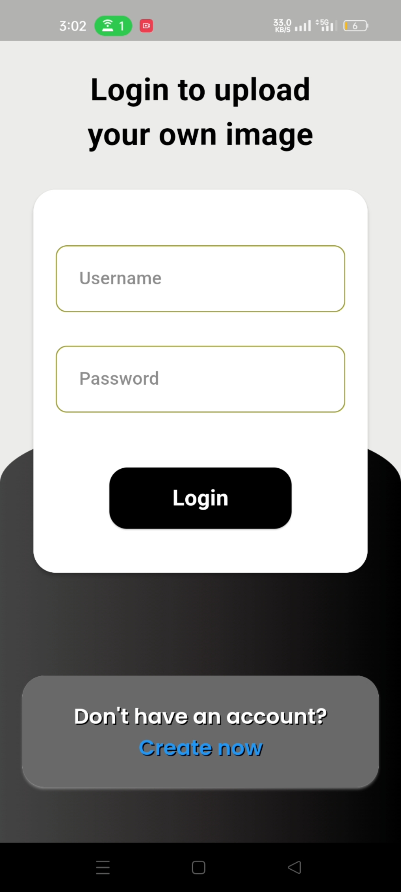
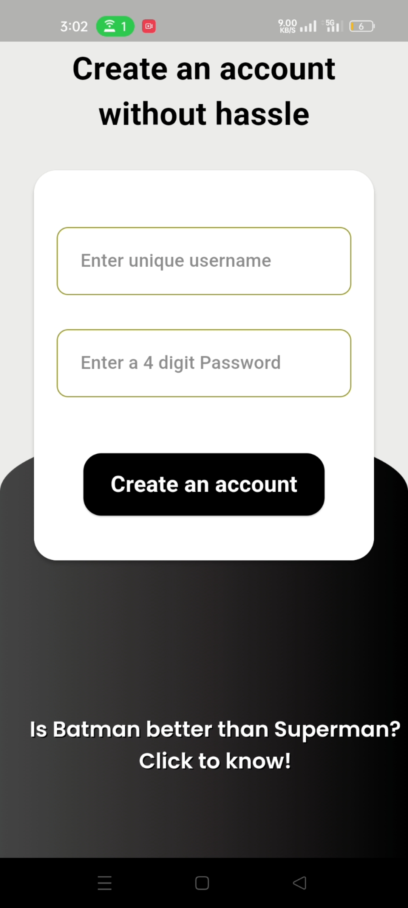
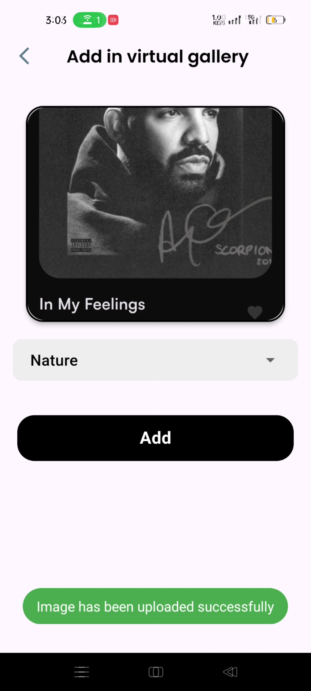
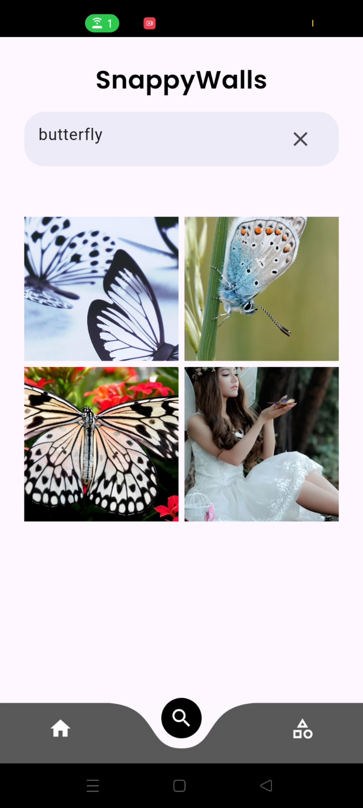
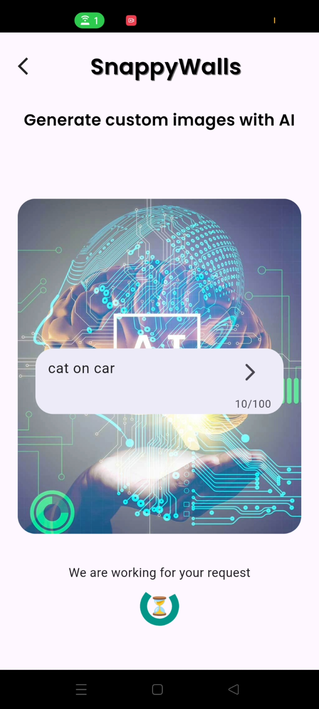
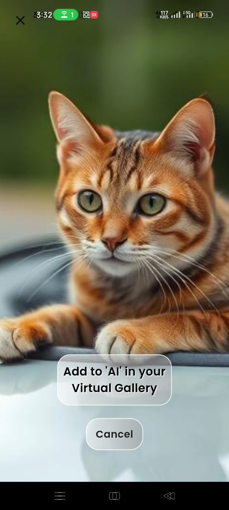

# SnappyWalls

SnappyWalls is an AI-integrated wallpaper application that allows users to search for images through the Pexels API, generate images using AI through text prompts, and add those images to their mobile devices to set as wallpapers.

## Video Demonstration

Watch the video demonstration of the app to see it in action:

[SnappyWalls Video Demonstration](https://vimeo.com/1049101672/42b21a858f?ts=0&share=copy)

## Screenshots

  
  
  
  
  
  

## Features

- **Appealing UI**: The app has a visually appealing user interface with smooth animations and transitions.
- **Multiple Screens**: The app includes various screens such as Home, Search, AI Image Generation, Virtual Gallery, and Authentication.
- **Authentication**: Users can sign up, sign in, and manage their profiles using Firebase Authentication.
- **State Management**: The app uses the Provider pattern for state management, ensuring a predictable and maintainable state.
- **Firebase Integration**: The app fetches data from Firebase Firestore and uses Firebase Storage for storing media files.
- **Clean Architecture**: The project follows a clean architecture, making it easy to scale and maintain.
- **AI Image Generation**: Users can generate custom images using AI by providing text prompts.
- **Favorites**: Users can add images to their favorites for easy access.

## Screens

- **Home Screen**: Users land on the home screen, which uses a carousel slider to display random images from Pexels each time the user visits this screen.
- **Admin Screen**: Users can log in from the admin screen.
- **Search Screen**: This screen consists of a search bar to fetch images from Pexels and display them in full screen for further operations.
- **AI Screen**: Users can type text to generate images using AI. Navigation to this screen is provided in the search screen and AI virtual gallery section.
- **Virtual Gallery**: This screen consists of different categories where users can upload images from their phone's local storage or store AI-generated images in the AI section of the virtual gallery.
- **Full Screen View**: Every image in any part of the app can be opened in full screen, giving users the option to store it on their mobile device to set as wallpaper.## Extras

- **Firebase Storage**: The app uses Firebase to store AI-generated and locally uploaded images, allowing users to access them in the future through the virtual gallery.

